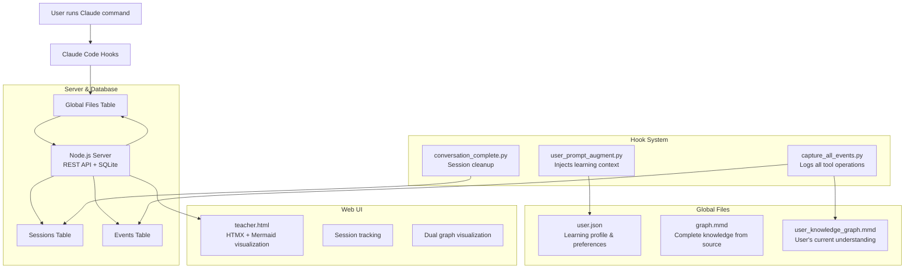

# Claude Teacher Mode

A persistent learning companion that transforms Claude Code into a teacher-aware system with global knowledge persistence, dual knowledge graphs, and comprehensive session tracking.

## Overview

Teacher Mode enables Claude to maintain a continuous understanding of what users learn across multiple sessions. Unlike standard Claude interactions that reset with each conversation, Teacher Mode creates a persistent learning profile and knowledge graph that evolves over time.

## Architecture & Data Flow



### Data Flow Sequence

1. **User runs Claude command** → Triggers hooks automatically
2. **user_prompt_augment.py** → Injects learning context from global files
3. **Claude processes** → Uses injected context to maintain learning continuity  
4. **capture_all_events.py** → Logs all tool operations and file changes
5. **Global files updated** → user.json, graphs synchronized to server
6. **Web UI refreshes** → Shows updated knowledge state in real-time
7. **conversation_complete.py** → Updates session metadata

## Quick Start

### 1. Clone and Setup Server

```bash
git clone <repository-url>
cd long_context_pedagogy
npm install
npm run dev  # Starts server on http://localhost:3001
```

### 2. Initialize a New Learning Repository

```bash
# Create a new learning workspace (default: test-workspace)
python3 setup_workspace.py

# Or specify custom directory
python3 setup_workspace.py -d my-learning-project

# This creates the specified directory with:
cd test-workspace  # or your custom directory

# Verify setup
ls -la .claude/
# Should show: hooks/, commands/, settings.json, CLAUDE.md
```

### 3. Start Learning

```bash
# Begin any learning session
claude -p "I want to learn about [your topic]"

# Continue building knowledge
claude -p "Explain [concept] in detail"
claude -p "What should I learn next?"

# View progress at: http://localhost:3001/teacher.html
```

## File Structure

```
long_context_pedagogy/
├── README.md
├── server.js                    # Node.js server with SQLite
├── package.json
├── public/teacher.html          # Web UI for visualization
├── setup_workspace.py          # General workspace initialization script
├── test_playwright_mcp.sh      # Playwright testing script
└── test-workspace/             # Example configured workspace
    ├── .claude/
    │   ├── hooks/              # Event capture hooks
    │   │   └── capture_events.py         # Single robust event logger
    │   ├── commands/
    │   │   └── study::init.md            # Learning initialization command
    │   ├── settings.json                 # Hook configuration
    │   └── CLAUDE.md                     # Learning mode instructions
    └── workspace/                        # Global learning files
        ├── user.json                     # Your learning profile
        ├── graph.mmd                     # Complete knowledge graph
        ├── user_knowledge_graph.mmd      # Your current understanding
        └── slices/                       # PDF/document chunks (if used)
```

## Hook System Details

### Simplified Event Capture

The system uses a single, robust event capture hook:

- **`capture_events.py`** (All Events: UserPromptSubmit, PostToolUse, Stop, SessionStart)
  - Captures complete stdin/stdout for every Claude Code event
  - Logs all tool operations with full input/output data
  - Records user prompts and Claude responses
  - Tracks session lifecycle events
  - Simple, reliable design that never disrupts Claude

### Configuration Files

- **`.claude/settings.json`** - Enables hooks and configures permissions
- **`.claude/CLAUDE.md`** - Instructions for teacher mode behavior
- **`workspace_protocol.md`** - Detailed system documentation

## Global Learning Files

### `user.json` - Your Learning Profile
```json
{
  "name": "Your Name",
  "profile": {
    "experience_level": "beginner|intermediate|advanced", 
    "learning_style": "conceptual|practical|visual",
    "interests": ["AI", "programming", "..."],
    "strengths": ["logical thinking", "..."],
    "challenges": ["complex math", "..."]
  },
  "learning_history": {
    "sessions": [...],
    "concepts_mastered": [...],
    "concepts_in_progress": [...],
    "current_focus": "Current learning topic"
  }
}
```

### `graph.mmd` - Complete Knowledge Graph
Mermaid diagram containing all concepts from source materials (PDFs, documents, etc.)

### `user_knowledge_graph.mmd` - Your Understanding
Mermaid diagram showing only concepts you've learned, with connections

## Web UI Features

Access at `http://localhost:3001/teacher.html`

- **Sessions Tab**: View all learning sessions with file counts and timestamps
- **Global Files Tab**: Access shared knowledge files across sessions  
- **Dual Graph View**: Compare complete knowledge vs. your understanding
- **Event Logging**: Track all tool operations and learning activities
- **Real-time Updates**: UI refreshes automatically as you learn

## API Endpoints

- `GET /sessions` - List all learning sessions
- `GET /sessions/:id` - Get specific session details
- `GET /global` - List all global files with versions
- `GET /global/:fileType` - Get specific global file content
- `POST /global/:fileType` - Update global file content
- `POST /events` - Log learning events (used by hooks)

## Testing with Playwright MCP

Add this section to your workspace's `CLAUDE.md` to enable Playwright testing:

```markdown
## Testing Teacher Mode with Playwright MCP

To test the teacher mode system using Playwright MCP server:

### Prerequisites
- Teacher mode server running: `npm start` 
- Test workspace created: `python3 setup_workspace.py`

### Test Commands

1. **Navigate to UI**:
Use Playwright MCP to navigate to http://localhost:3001/teacher.html and verify the interface loads

2. **Verify Session Tracking**:
Use Playwright to:
- Check Sessions tab shows active learning sessions
- Click on a session with files
- Verify all 4 panels display: User Model, Full Knowledge Graph, User's Knowledge, Recent Events
- Take screenshot for documentation

3. **Test Global File Persistence**:
Use Playwright to:
- Click Global Files tab  
- Verify these files exist with version numbers: user.json, graph.mmd, user_knowledge_graph.mmd
- Click each file to view content
- Verify knowledge graphs render as Mermaid diagrams

4. **Test Multi-Session Persistence**:
After creating multiple Claude sessions:
- Verify all sessions appear in Sessions tab
- Check that global files persist across sessions
- Confirm user.json shows accumulated learning history
- Verify knowledge graphs contain concepts from all sessions

### Expected Results
- ✅ Sessions appear with file counts and timestamps
- ✅ Global files show proper version increments
- ✅ Knowledge graphs render with Mermaid
- ✅ User profile evolves with learning
- ✅ Events log all tool operations
```

## Initialization Process

When you run `python3 setup_workspace.py`, the system:

### 1. Creates Directory Structure
```bash
test-workspace/  # or custom directory specified with -d
├── .claude/
│   ├── hooks/          # Copies capture_events.py hook
│   ├── commands/       # Copies study::init.md command
│   ├── settings.json   # Configures hook permissions
│   └── CLAUDE.md       # Learning mode instructions
└── workspace/
    ├── user.json       # Initial empty learning profile
    ├── graph.mmd       # Empty knowledge graph
    ├── user_knowledge_graph.mmd  # Empty user graph
    └── slices/         # Directory for document chunks
```

### 2. Configures Hook Permissions
Sets up `.claude/settings.json` to enable:
- UserPromptSubmit hooks (event capture)
- PostToolUse hooks (event capture)  
- Stop hooks (event capture)
- SessionStart hooks (auto-initialization)
- Tool allowlist for server communication

### 3. Initializes Learning Files
- **user.json**: Empty profile ready for personalization
- **graph.mmd**: Template for source knowledge
- **user_knowledge_graph.mmd**: Template for user's understanding
- **test_prompts.md**: Example learning prompts

### 4. Validates Setup  
- Tests hook execution
- Verifies file permissions
- Confirms server connectivity
- Reports setup status

## Advanced Usage

### Custom Learning Domains
Add your own PDFs/documents to create domain-specific knowledge graphs:

```bash
claude -p "/study::init path/to/your-document.pdf"
```

### Multi-User Support
Each workspace maintains separate user profiles while sharing the server infrastructure.

### Knowledge Export
Global files are standard JSON/Mermaid formats, easily exportable for other tools.

## Troubleshooting

### Hooks Not Firing
```bash
# Check permissions
ls -la .claude/hooks/*.py

# Verify settings
cat .claude/settings.json

# Test hook execution  
echo '{"session_id":"test"}' | python3 .claude/hooks/user_prompt_augment.py
```

### Server Issues
```bash
# Check server logs
npm start

# Test endpoints
curl http://localhost:3001/sessions
curl http://localhost:3001/global
```

### UI Not Loading
- Ensure server running on port 3001
- Check browser console for errors
- Verify HTMX and Mermaid CDN access

## Contributing

The system is designed for extensibility:
- Add new hooks for custom behaviors
- Extend the API with additional endpoints  
- Customize the UI for specific learning domains
- Create new slash commands for specialized workflows

---

**Teacher Mode transforms Claude from a conversational AI into a persistent learning companion that grows with you over time.**
